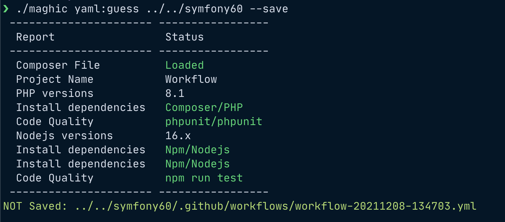

# Maghic
Ma**gh**ic is a Swiss army knife tool for GitHub Actions Workflow.

> This project is a W.I.P. for "2021 GitHub Actions Hackathon on DEV". It is not yet completed and it is under development as side project.

It provides:
- a command line tool for managing, creating and autogenerate Yaml file Workflow for GitHub Actions;
- a set of classes and methods for managing Yaml file (specific for GitHub Actions Workflows).

This is created for the GitHub Actions Hackathon: [2021 GitHub Actions Hackathon on DEV](https://dev.to/devteam/join-us-for-the-2021-github-actions-hackathon-on-dev-4hn4)


## Auto generate workflows
If you want to create automatically a GitHub Actions workflow file you can execute "maghic yaml:guess" command.
If you want to save the file, you need to use *--save* option.
Amandatory argument is the directory of the project that needs a workflow file.
If you want to enable a MySql service, you need to use *--mysql* option.
```shell
./maghic yaml:guess --mysql --save .
```
If you want to show the workflow file, you can use *--show* option:
```shell
./maghic yaml:guess --show .
```
The *yaml:guess* command will inspect your project detecting some characteristics to guess the workflow:
- a dependencies file like composer.json (for PHP), packages.json (for Node/JS) etc.;
- the dependencies: if there are some relevant dependencies like testing tool, static code analysis or code sniffer;
- .nvmrc to identify the right version of Node in the pipeline
- ...




## References

### Packages
- [Laravel Zero](https://laravel-zero.com/): micro framework for console application; 
- [Symfony Yaml](https://symfony.com/doc/current/components/yaml.html): a package for parsing Yaml structures.
- [swaggest/json-schema](https://github.com/swaggest/php-json-schema): a package to validate the GitHub Actions workflow.
#### Code quality packages
- [PestPHP](https://pestphp.com/): a testing framework for PHP;
- [PHPStan](https://phpstan.org/): a static code analysis tool for PHP;
- [PHP_CodeSniffer](https://github.com/squizlabs/PHP_CodeSniffer): detects violations of a defined set of coding standards (for example PSR2 and PSR12).
